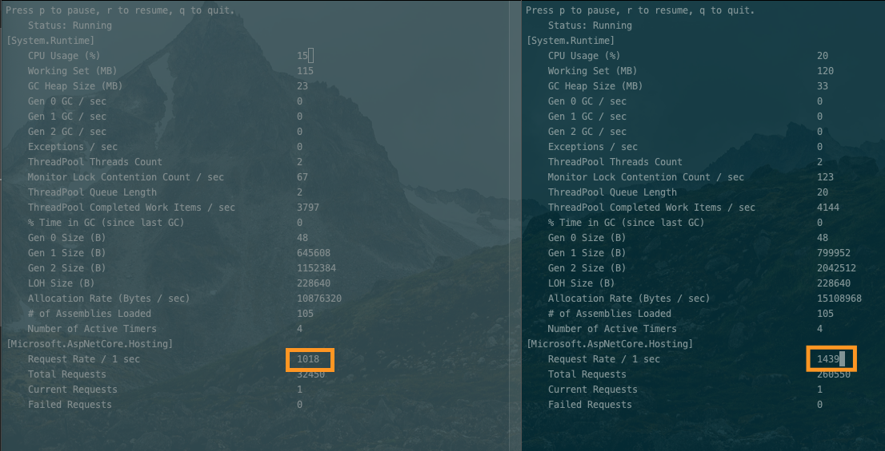
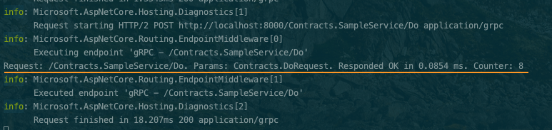
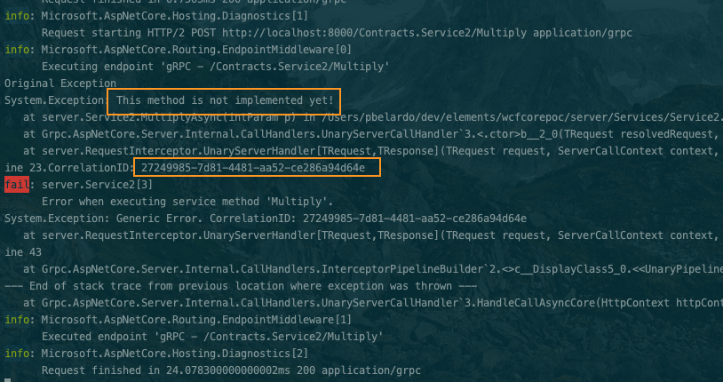
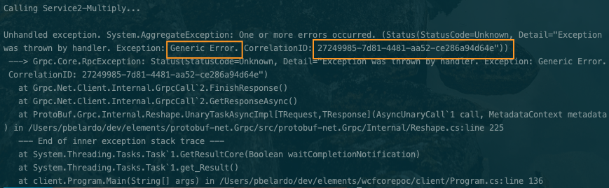

# WCF to GRPC PoC

The main purpose of this PoC is to do an excercise about how to move from WCF solutions to GRPC.

## Grpc CodeFirst 

The supported and recommended way to implement Grpc on .net core is documented [here](https://docs.microsoft.com/en-us/aspnet/core/grpc/aspnetcore?view=aspnetcore-3.0&tabs=visual-studio).This approach is using .proto files.

For this PoC, we were looking for alternatives to reuse the same service definition we have in current projects, and use these definitions for GRPC communication.

To acomplish with this requirement, we didn't use protocol buffer files (.proto). For that purpose, we used [protobuf-net.grpc](https://github.com/protobuf-net/protobuf-net.Grpc) libraries.

Notes:
- We used [.net core 3.0 preview 7+](https://dotnet.microsoft.com/download/dotnet-core/3.0)
- We referenced compiled assemblies for some packages and not nuget packages because weren't available when we did the PoC (we compiled those from source code)

## Service Definition


Here is a basic exmple (*ISampleService*)
````csharp
    [ServiceContract]
    public interface ISampleService
    {
        [OperationContract]
        Task<DoResponse> DoAsync(DoRequest request);
    }
````

**Sub-types**
In case you are using sub-types, you need to set the *ProtoInclude* attribute as part of the service definition

````csharp
    [DataContract]
    public class DoRequest
    {
        [DataMember(Order = 1)]
        public List<Shape> Shapes { get; set; }
    }

    //Protoinclude is part of protobuf-net implementation and will allow to include derived classes
    [DataContract, ProtoInclude(4, typeof(Circle))]
    public abstract class Shape
    {
        public int S1 { get; set; }
        public int S2 { get; set; }
    }

    [DataContract]
    public class Circle : Shape
    {
        public int C1 { get; set; }
        public int C2 { get; set; }
    }
````

## RequestInterceptor

One of the requirements for this PoC is the ability to capture every call the service is receiving and log information about it.
In addition, in case of exceptions, we need to capture them and raise a new exception with less details to the client (Exception shielding).
In both cases we used an interceptor:

````csharp
    public void ConfigureServices(IServiceCollection services)
    {
        services.AddGrpc(options =>
                {
                    options.Interceptors.Add<RequestInterceptor>();
                    options.EnableDetailedErrors = true;
                });

        services.AddSingleton<RequestInterceptor>();
        services.AddCodeFirstGrpc();
    }
````

The implementation of the interceptor looks like this:

````csharp
    public class RequestInterceptor : Interceptor
    {
        private const string MessageTemplate = "{RequestMethod} responded {StatusCode} in {Elapsed:0.0000} ms";
        private static int counter = 0;

        
        public override async Task<TResponse> UnaryServerHandler<TRequest, TResponse>(TRequest request, ServerCallContext context, UnaryServerMethod<TRequest, TResponse> continuation)
        {
            TResponse response= null;
            try
            {
                var sw = Stopwatch.StartNew();
                //Request
                response = await base.UnaryServerHandler(request, context, continuation);

                //Response
                counter++;
                sw.Stop();

                Console.WriteLine($"Request: {context.Method}. Params: {request}. Responded {context.Status.StatusCode} in {sw.Elapsed.TotalMilliseconds:0.0000} ms. Counter: {counter}");
            }
            catch (System.Exception ex) 
            {
                var correlationID = Guid.NewGuid();

                Console.WriteLine("Original Exception");
                Console.WriteLine($"{ex}.CorrelationID: {correlationID}");

                

                context.ResponseTrailers.Add(new Metadata.Entry("Source", ex.Source));
                context.ResponseTrailers.Add(new Metadata.Entry("Parameters", request.ToString()));
                await context.WriteResponseHeadersAsync(new Metadata());
                throw new Exception($"Generic Error. CorrelationID: {correlationID}");
            }

            return response;
        }
    }
````


## Conclusion

As conclusion for this PoC, we can see there is a way to move to Grpc using a similar approach to what we are doing today with WCF. Although this approach is working, we know there will be challenges over the course of the migration, as the case of primitive return types (can't be returned as-is on service definitions), so we recommend analyze the approach and evaluate other aspects appropiately. 

**Load**

To create load, we deployed this solution into a Kubernetes cluster, and created 20 client instances and 2 servers, to evaluate load balancing and how the solution performs in general. Deployment definition can be found at *deployment.yml* file.



**Logging**



**Exception Shielding**

At server



At client




## References

- [Security Considerations](https://docs.microsoft.com/en-us/aspnet/core/grpc/security?view=aspnetcore-3.0)

